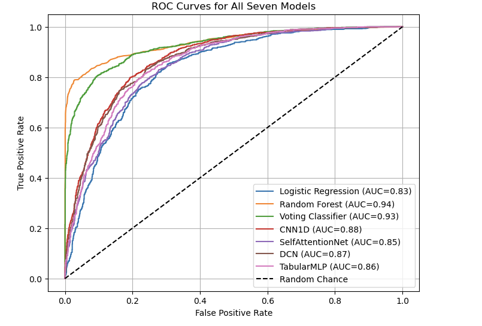
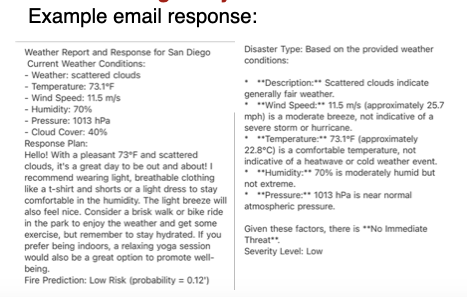

## LLM Based Agent System for Automated Weather Disaster Management

Author: Xiang Gao, Chengpeng Xing, Siqi Wang, Xiaoyuan Ren

ECE228_Machine Learning for Physical Application

### 1. Files Description
- **`data/`**  
  - Contains all of the CSV data splits and the serialized Random Forest model.  
  - **`train.csv`**: Historical weather features (temperature, humidity, wind speed, precipitation, etc.) and a binary label (`label`) indicating whether a wildfire occurred.  
  - **`test.csv`**: The held-out test set for evaluating classifier performance.
    
- **`result/`**
  - The `result/` directory contains all generated figures and sample outputs:
  - **`result/ROC_curves.png`**  :ROC curve comparison for six classifiers on the test set.
  - **`result/Example_email_response.png`**  :Screenshot of an example email alert generated by the LLM agent.

- **`7models_comparison.ipynb`**  
  - Reads `data/train.csv` and `data/test.csv`, preprocesses features, trains six different ML classifiers (Logistic Regression, Random Forest, ,MLP, CNN1D, etc.), computes performance metrics (accuracy, ROC-AUC, F1, recall), and plots ROC curves.  
  - Exports the best Random Forest model to `data/rf_model.joblib`.

- **`agent.ipynb`**  
  - Loads `data/rf_model.joblib` to perform real-time wildfire risk prediction.  
  - Demonstrates how the LLM agent wraps predictions in natural-language prompts.  
  - Requires a valid Gemini API key or the endpoint of another GPT-compatible model.  
  - Shows sample email generation and deviation analysis.
  
- **`rf_model.joblib`**: Serialized Random Forest model exported from `6models-wholedat.ipynb`. You can load this directly (skipping retraining) in `agent.ipynb` or any custom Python script.
  
- **`poster.pptx`**  
  - Presentation-style poster that summarizes our approach, dataset, experimental results, and example agent outputs. Use this file to verify that your notebook outputs match the figures and text on the poster.

---

## Environment & Dependencies

Below is a concise summary of the environment and prerequisites needed to run the two Jupyter notebooks in this repository.

---

### 2. Common Requirements

- **Python Version**  
  - Python 3.8 or later (3.9+ recommended).

- **Virtual Environment (recommended)**  
  ```bash
  python3 -m venv venv
  source venv/bin/activate        # macOS/Linux
  venv\Scripts\activate           # Windows
  pip install --upgrade pip
  pip install pandas numpy scikit-learn matplotlib seaborn joblib jupyterlab ipykernel

- **API KEY**
  - Remember to export your own api key. Set as environment variable before launching Jupyter:
    ```bash
    export OPENAI_API_KEY="your_api_key_here"      # macOS/Linux
    setx OPENAI_API_KEY "your_api_key_here"        # Windows (PowerShell)
## 3. Results

After installing all requirements, you can run both `6models-wholedata.ipynb` and `agent.ipynb` to reproduce the following tables and images.

---

### 3.1 ML Model Performance (Poster Tables)

Below is the output comparison table of `7models_comparison.ipynb`
| Model               | Accuracy  | Recall   | F1        | AUC       |
|---------------------|-----------|----------|-----------|-----------|
| Logistic Regression | 0.766758  | 0.673061 | 0.677298  | 0.834699  |
| Random Forest       | 0.890507  | 0.828190 | 0.846187  | 0.939543  |
| Voting Classifier   | 0.862299  | 0.818182 | 0.812086  | 0.927401  |
| CNN1D               | 0.805278  | 0.746455 | 0.736020  | 0.876409  |
| SelfAttentionNet    | 0.766758  | 0.793995 | 0.712308  | 0.848185  |
| DCN                 | 0.799211  | 0.760634 | 0.733079  | 0.868866  |
| TabularMLP          | 0.791629  | 0.742285 | 0.721524  | 0.860043  |

---
### 3.2 ROC Curves

<figure>
  
  <figcaption>Figure 1: ROC curves for six classifiers on the test set.</figcaption>
</figure>

### 3.3 Example email response
Below is the output of our weather agent.

<figure>
  
  <figcaption>Figure 2: Excerpt from project poster summarizing data sources and methodology.</figcaption>
</figure>

